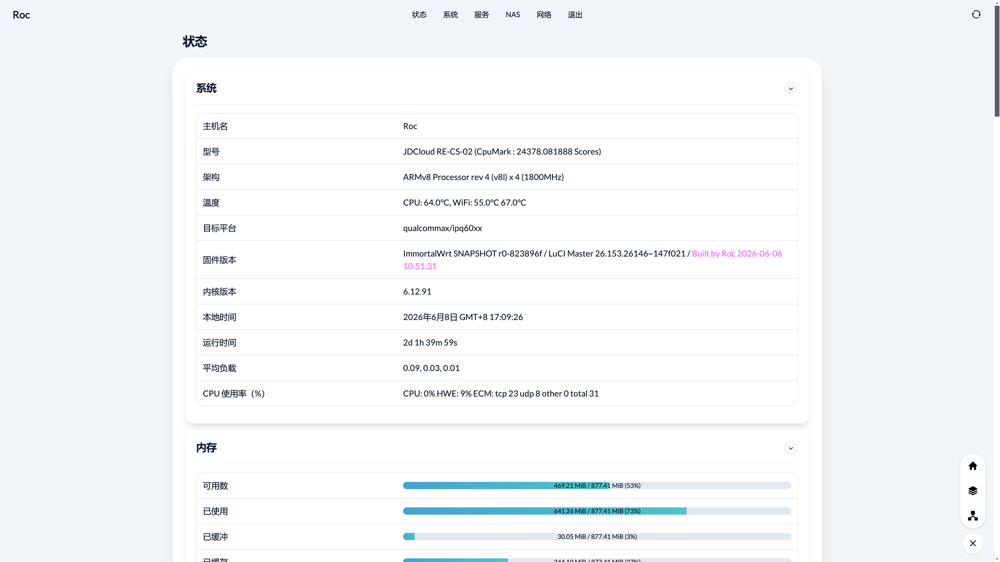

<h1>OpenWrt — 云编译</h1>

## 特别提示

- **本人不对任何人因使用本固件所遭受的任何理论或实际的损失承担责任！**

- **本固件禁止用于任何商业用途，请务必严格遵守国家互联网使用相关法律规定！**

## 项目说明
- 默认管理地址：**`192.168.2.1`**，默认用户：**`root`**，默认密码：**`无`**
- [云编译来源](https://github.com/haiibo/OpenWrt) [视频教程](https://www.youtube.com/watch?v=6j4ofS0GT38) [问题合集](https://github.com/LiBwrt/openwrt-6.x/issues)

## 仓库说明
- 本人 fork 的仓库：[ImmortalWrt](https://github.com/laipeng668/immortalwrt) [LibWrt](https://github.com/laipeng668/openwrt-6.x)，内容大体一致。
- `ImmortalWrt` 和 `LibWrt` 分别通过 rebase 和 merge 进行更新，相互印证。
- `LibWrt` 因为 DTS 更为丰富，所以支持更多的机型。

## 定制固件
- 首先要登录 Github 账号，然后 fork 此项目到你自己的 Github 仓库。
- 修改 `configs` 目录对应的文件添加或删除插件，或者上传自己的 `xx.config` 配置文件。
- 不需要的软件包请把 `y` 改成 `n` ，仅在前面添加 `#` 是无效的。
- 插件对应名称及功能请参考恩山网友帖子：[OpenWrt软件包全量解释](https://www.right.com.cn/FORUM/forum.php?mod=viewthread&tid=8384897)。
- 如需修改默认 IP、添加或删除插件包以及一些其他设置请在 `Roc-script.sh` 文件内修改。
- 添加或修改 `xx.yml` 文件，最后点击 `Actions` 运行要编译的 `workflow` 即可开始编译。
- 编译大概需要 1-2 小时，编译完成后在仓库主页 [Releases](https://github.com/laipeng668/openwrt-ci-roc/releases) 对应 Tag 标签内下载固件。

## 单独编译软件包
- 点击 `Actions` 运行 `Build-Packages`，`sdk_version` 可选择 `ALL` 同时编译全部版本，或选择 `main` 主线 snapshots、`23.05`、`24.10`、`25.12` 系列的最新稳定版 SDK。
- 默认同时编译 `x86-64` 和 `aarch64` 两个架构：`x86/64` 使用 `configs/x86-64.config + configs/Packages.config`；`aarch64` 在 `main`、`25.12` 使用 `configs/JDCloud.config + configs/Packages.config`，在 `23.05`、`24.10` 使用 SDK 脚本内置的 rax3000m 配置 + `configs/Packages.config`。
- `package` 默认是 `ALL`，下拉只保留独立软件包 `nginx`，以及 `luci-app-aria2`、`luci-app-frpc`、`luci-app-frps`、`luci-app-gecoosac`、`luci-app-openlist2`、`luci-theme-aurora` 这些 LuCI 入口；选择 LuCI 软件包时会同时编译并发布对应基础包，其中 `luci-app-aria2` 会一并处理 `aria2` 和 `ariang`。旧的 `aria2`、`ariang`、`frp`、`gecoosac`、`openlist2` 输入仅作为兼容别名保留。
- 脚本会按每个矩阵的版本和架构从 `https://downloads.openwrt.org/` 自动查找对应 SDK。
- 实际编译的软件包会参考 `configs/Packages.config` 里的软件包选项，例如 `aria2`、`ariang`、`frpc`、`frps`、`nginx-full`、`luci-app-gecoosac`、`luci-app-aurora-config`、`luci-app-openlist2` 和 `luci-theme-aurora`。
- 编译的软件包来源固定为：
  - `https://github.com/laipeng668/packages` 的 `aria2` 分支：`net/aria2`
  - `https://github.com/laipeng668/packages` 的 `ariang` 分支：`net/ariang`
  - `https://github.com/laipeng668/packages` 的 `frp-binary-toml` 分支：`net/frp`
  - `https://github.com/laipeng668/packages` 的 `nginx` 分支：`net/nginx`
  - `https://github.com/laipeng668/luci` 的 `frp-toml` 分支：`applications/luci-app-frpc`、`applications/luci-app-frps`
  - `https://github.com/laipeng668/luci-app-gecoosac` 的 `main` 分支：`gecoosac`、`luci-app-gecoosac`
  - `https://github.com/laipeng668/luci-app-openlist2` 的 `main` 分支：`openlist2`、`luci-app-openlist2`
  - `https://github.com/eamonxg/luci-theme-aurora` 的 `main` 分支：`luci-theme-aurora`
  - `https://github.com/eamonxg/luci-app-aurora-config` 的 `main` 分支：`luci-app-aurora-config`
- 编译产物会按 `<SDK>-<软件包>-<架构>.zip` 分组打包，上传到本次 workflow 的 `Artifacts`，并发布到 `Packages` 这个 [Releases](https://github.com/laipeng668/openwrt-ci-roc/releases/tag/Packages)；普通分组内的 `.apk/.ipk` 文件也使用对应架构后缀。`luci-theme-aurora` 是通用主题包，使用 `all` 架构后缀，`arch=ALL` 时也只保留一份。下载后先解压，`apk` 使用 `apk add --allow-untrusted *.apk` 安装，`ipk` 使用 `opkg install *.ipk` 安装。

## 页面预览

